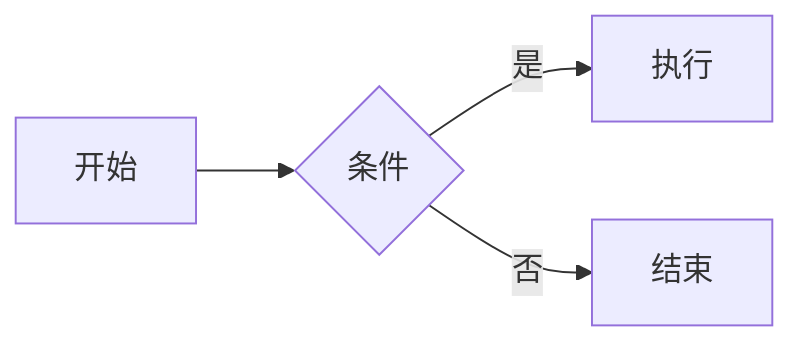

# 🗓️ 个人计划 - 2025/11/15
> 最后更新时间： 2025/11/15
- **立即开始：** 今天就创建 GitHub 仓库，git init
- **先做 MVP：** 只做最核心的“写笔记 + AI 总结”功能
- **每天记录：** 用 Logseq / Obsidian 记录开发日志，这就是你的成长轨迹
- **对外输出：** 在掘金、知乎、小红书分享开发过程，获得反馈

## ✅ 今日重点（Top 3）
- [ ] 
- [ ] 
- [ ] 

## 📌 待办事项（TODO）
### 💻 开发任务
- [ ] 
- [ ] 

### 📚 学习提升
- [ ] 
- [ ] 

### 🧹 其他事务
- [ ] 
- [ ] 

## 🔄 进行中（In Progress）
- [ ] 

## ✅ 已完成（Done）
- [x] 

---

## 📊 反思与改进
- 今天做得好的地方：
- 需要改进的地方：