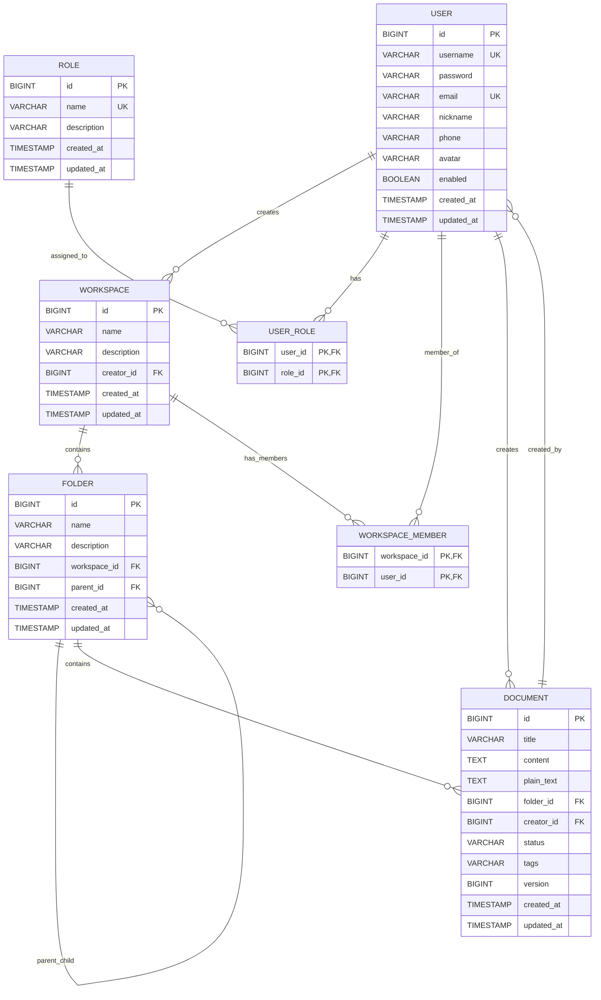

# NexusMind 数据库表设计

## 数据库概述

**数据库类型：** H2 Database (开发环境) / PostgreSQL 14+ (生产环境)  
**ORM 框架：** Spring Data JPA / Hibernate  
**审计机制：** JPA Auditing (自动管理 created_at, updated_at 字段)

---

## 数据表详细设计

### 1. user - 用户表

**描述：** 存储系统用户的基本信息和角色关联

| 字段名 | 数据类型 | 约束 | 说明 |
|--------|---------|------|------|
| id | BIGINT | PRIMARY KEY, AUTO_INCREMENT | 主键 ID |
| username | VARCHAR(50) | NOT NULL, UNIQUE | 用户名（登录用） |
| password | VARCHAR(255) | NOT NULL | 密码（BCrypt 加密） |
| email | VARCHAR(100) | NOT NULL, UNIQUE | 邮箱地址 |
| nickname | VARCHAR(50) | NULL | 用户昵称 |
| phone | VARCHAR(20) | NULL | 手机号码 |
| avatar | VARCHAR(500) | NULL | 头像 URL |
| enabled | BOOLEAN | DEFAULT TRUE | 是否启用 |
| created_at | TIMESTAMP | NOT NULL | 创建时间（自动审计） |
| updated_at | TIMESTAMP | NULL | 更新时间（自动审计） |

**关联关系：**
- 一对多：workspace (用户创建的工作空间)
- 多对多：role (用户角色，通过 user_role 中间表)
- 多对多：workspace (用户参与的工作空间，通过 workspace_member 中间表)

**索引：**
- idx_user_username (username)
- idx_user_email (email)

---

### 2. role - 角色表

**描述：** 存储系统角色的定义

| 字段名 | 数据类型 | 约束 | 说明 |
|--------|---------|------|------|
| id | BIGINT | PRIMARY KEY, AUTO_INCREMENT | 主键 ID |
| name | VARCHAR(50) | NOT NULL, UNIQUE | 角色名称（ROLE_ADMIN, ROLE_USER） |
| description | VARCHAR(200) | NULL | 角色描述 |
| created_at | TIMESTAMP | NOT NULL | 创建时间（自动审计） |
| updated_at | TIMESTAMP | NULL | 更新时间（自动审计） |

**关联关系：**
- 多对多：user (通过 user_role 中间表)

**索引：**
- idx_role_name (name)

---

### 3. user_role - 用户角色关联表

**描述：** 用户与角色的多对多关联关系

| 字段名 | 数据类型 | 约束 | 说明 |
|--------|---------|------|------|
| user_id | BIGINT | NOT NULL, FOREIGN KEY | 用户 ID（关联 user.id） |
| role_id | BIGINT | NOT NULL, FOREIGN KEY | 角色 ID（关联 role.id） |

**联合主键：** (user_id, role_id)

**外键约束：**
- FK_user: FOREIGN KEY (user_id) REFERENCES user(id)
- FK_role: FOREIGN KEY (role_id) REFERENCES role(id)

---

### 4. workspace - 工作空间表

**描述：** 存储工作空间信息，用于组织和管理文件夹与文档

| 字段名 | 数据类型 | 约束 | 说明 |
|--------|---------|------|------|
| id | BIGINT | PRIMARY KEY, AUTO_INCREMENT | 主键 ID |
| name | VARCHAR(200) | NOT NULL | 工作空间名称 |
| description | VARCHAR(500) | NULL | 工作空间描述 |
| creator_id | BIGINT | NOT NULL, FOREIGN KEY | 创建者 ID（关联 user.id） |
| created_at | TIMESTAMP | NOT NULL | 创建时间（自动审计） |
| updated_at | TIMESTAMP | NULL | 更新时间（自动审计） |

**关联关系：**
- 多对一：user (creator_id，工作空间创建者)
- 一对多：folder (工作空间下的文件夹)
- 多对多：user (工作空间成员，通过 workspace_member 中间表)

**索引：**
- idx_workspace_creator (creator_id)

---

### 5. workspace_member - 工作空间成员关联表

**描述：** 工作空间与成员的多对多关联关系

| 字段名 | 数据类型 | 约束 | 说明 |
|--------|---------|------|------|
| workspace_id | BIGINT | NOT NULL, FOREIGN KEY | 工作空间 ID（关联 workspace.id） |
| user_id | BIGINT | NOT NULL, FOREIGN KEY | 用户 ID（关联 user.id） |

**联合主键：** (workspace_id, user_id)

**外键约束：**
- FK_workspace: FOREIGN KEY (workspace_id) REFERENCES workspace(id)
- FK_user_member: FOREIGN KEY (user_id) REFERENCES user(id)

---

### 6. folder - 文件夹表

**描述：** 存储文件夹信息，支持树形结构

| 字段名 | 数据类型 | 约束 | 说明 |
|--------|---------|------|------|
| id | BIGINT | PRIMARY KEY, AUTO_INCREMENT | 主键 ID |
| name | VARCHAR(200) | NOT NULL | 文件夹名称 |
| description | VARCHAR(500) | NULL | 文件夹描述 |
| workspace_id | BIGINT | NOT NULL, FOREIGN KEY | 所属工作空间 ID（关联 workspace.id） |
| parent_id | BIGINT | NULL, FOREIGN KEY | 父文件夹 ID（关联 folder.id，NULL 表示根文件夹） |
| created_at | TIMESTAMP | NOT NULL | 创建时间（自动审计） |
| updated_at | TIMESTAMP | NULL | 更新时间（自动审计） |

**关联关系：**
- 多对一：workspace (workspace_id，所属工作空间)
- 多对一：folder (parent_id，父文件夹，实现树形结构)
- 一对多：folder (子文件夹)
- 一对多：document (文件夹下的文档)

**索引：**
- idx_folder_workspace (workspace_id)
- idx_folder_parent (parent_id)
- idx_folder_workspace_parent (workspace_id, parent_id) - 复合索引

---

### 7. document - 文档表

**描述：** 存储文档内容及其元数据，支持版本控制

| 字段名 | 数据类型 | 约束 | 说明 |
|--------|---------|------|------|
| id | BIGINT | PRIMARY KEY, AUTO_INCREMENT | 主键 ID |
| title | VARCHAR(500) | NOT NULL | 文档标题 |
| content | TEXT | NULL | 文档内容（富文本/HTML 格式） |
| plain_text | TEXT | NULL | 纯文本内容（用于全文搜索） |
| folder_id | BIGINT | NOT NULL, FOREIGN KEY | 所属文件夹 ID（关联 folder.id） |
| creator_id | BIGINT | NOT NULL, FOREIGN KEY | 创建者 ID（关联 user.id） |
| status | VARCHAR(50) | DEFAULT 'DRAFT' | 文档状态（DRAFT, PUBLISHED, ARCHIVED） |
| tags | VARCHAR(500) | NULL | 标签（逗号分隔） |
| version | BIGINT | DEFAULT 0 | 版本号（乐观锁） |
| created_at | TIMESTAMP | NOT NULL | 创建时间（自动审计） |
| updated_at | TIMESTAMP | NULL | 更新时间（自动审计） |

**关联关系：**
- 多对一：folder (folder_id，所属文件夹)
- 多对一：user (creator_id，文档创建者)

**索引：**
- idx_document_folder (folder_id)
- idx_document_creator (creator_id)
- idx_document_title (title) - 用于标题搜索
- idx_document_status (status)

---

## 实体关系图 (ER Diagram)



---

## 数据初始化

### 系统启动时自动创建

**角色数据：**
1. ROLE_ADMIN - 管理员角色
2. ROLE_USER - 普通用户角色

**测试用户数据：**
1. 管理员账户：
   - 用户名：admin
   - 密码：admin123
   - 邮箱：admin@nexusmind.com
   - 角色：ROLE_ADMIN, ROLE_USER

2. 普通用户账户：
   - 用户名：user
   - 密码：user123
   - 邮箱：user@nexusmind.com
   - 角色：ROLE_USER

---

## 数据库配置

### 开发环境 (H2)

```yaml
spring:
  datasource:
    url: jdbc:h2:mem:nexusmind_db
    driver-class-name: org.h2.Driver
    username: sa
    password: 
  
  h2:
    console:
      enabled: true
      path: /h2-console
  
  jpa:
    database-platform: org.hibernate.dialect.H2Dialect
    hibernate:
      ddl-auto: update
```

### 生产环境 (PostgreSQL)

```yaml
spring:
  datasource:
    url: jdbc:postgresql://localhost:5432/nexusmind_db
    driver-class-name: org.postgresql.Driver
    username: nexusmind
    password: your_password
  
  jpa:
    database-platform: org.hibernate.dialect.PostgreSQLDialect
    hibernate:
      ddl-auto: validate
```

---

## 表设计特点

### 1. 审计字段
所有表都包含 `created_at` 和 `updated_at` 字段，通过 JPA Auditing 自动管理：
- `@CreatedDate` - 实体创建时自动设置
- `@LastModifiedDate` - 实体更新时自动更新

### 2. 树形结构支持
`folder` 表通过 `parent_id` 自引用实现无限层级的树形结构。

### 3. 乐观锁机制
`document` 表包含 `version` 字段，用于实现乐观锁，防止并发更新冲突。

### 4. 软删除预留
所有实体都包含 `enabled` 或 `status` 字段，为未来的软删除功能预留支持。

### 5. 全文搜索支持
`document` 表包含 `plain_text` 字段，存储纯文本内容用于全文搜索（未来可集成 Elasticsearch）。

---

## 索引优化建议

### 已有索引
- 所有外键字段自动创建索引
- 所有唯一约束字段自动创建索引

### 建议添加的索引（生产环境）
```sql
-- 用户表
CREATE INDEX idx_user_enabled ON "user"(enabled);
CREATE INDEX idx_user_created_at ON "user"(created_at);

-- 文档表
CREATE INDEX idx_document_created_at ON document(created_at);
CREATE INDEX idx_document_status_created ON document(status, created_at);
CREATE INDEX idx_document_folder_creator ON document(folder_id, creator_id);

-- 文件夹表
CREATE INDEX idx_folder_created_at ON folder(created_at);
```

---

**最后更新：** 2026-04-03  
**版本：** v2.0  
**维护者：** NexusMind 开发团队
